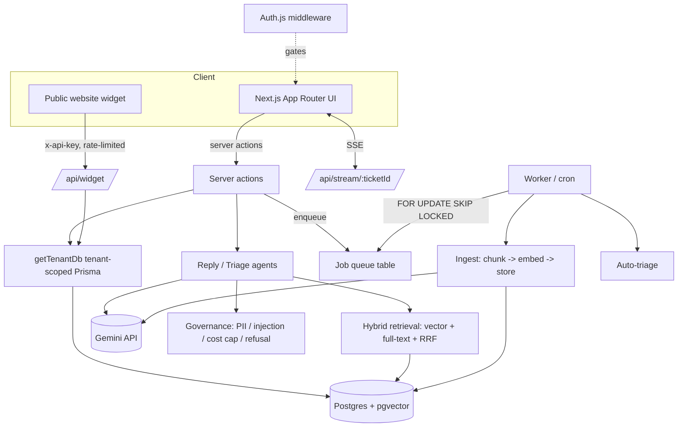

# Architecture

A multi-tenant AI support platform: companies sign up, their agents handle tickets, and an AI agent
drafts grounded replies from that tenant's knowledge base (human-approved before send) and auto-triages
incoming tickets.

## Request flow

## Components

| Concern | Implementation |
| --- | --- |
| Framework | Next.js 16 (App Router, server actions, route handlers), React 19, TypeScript, Tailwind 4 |
| Data | PostgreSQL + **pgvector**; Prisma 7 with the `@prisma/adapter-pg` driver adapter |
| Multi-tenancy | `getTenantDb()` — a Prisma client `$extends` that injects `tenantId` into every read/update/delete; proven by an isolation test |
| Auth | Auth.js v5, credentials + JWT (bcrypt); JWT carries `tenantId` + `role`; `middleware.ts` gates routes |
| Real-time | Server-Sent Events over an in-process pub/sub (`lib/realtime.ts` → `/api/stream/:id`) |
| RAG | structure-aware chunking → Gemini embeddings (768-d) → pgvector; **hybrid retrieval** (cosine + Postgres full-text) fused with Reciprocal Rank Fusion |
| Agent | typed state machine: plan → retrieve → (refuse if no grounding) → draft w/ citations → self-critique faithfulness → propose / refuse |
| Background jobs | self-hosted Postgres queue (`FOR UPDATE SKIP LOCKED`, exponential backoff, retries); worker + Vercel cron |
| Governance | PII redaction, prompt-injection sanitizer, per-tenant cost cap, restricted-topic refusal, audit log |
| AI Ops | eval harness with a CI faithfulness gate; `/metrics` (cost, p95 latency, acceptance/refusal, faithfulness) |

## Key design decisions

See [`adr/`](./adr) for the rationale behind Auth.js (vs Clerk), SSE (vs Pusher), the self-hosted job
queue (vs Inngest), Gemini's free tier, and the tenant-isolation pattern.

## Data model (Prisma)

`Tenant` ← `User` (role, passwordHash) · `Document` → `Chunk` (vector(768)) · `Ticket` → `Message`
(CUSTOMER/AGENT/AI) · `AiSuggestion` (draft, citations, faithfulness, cost, latency, status) ·
`AuditLog` · `ApiKey` · `Job` (type, payload, status, attempts, runAt).

Creates pass `tenantId` explicitly (type-enforced); all other access is auto-scoped by `getTenantDb`.
